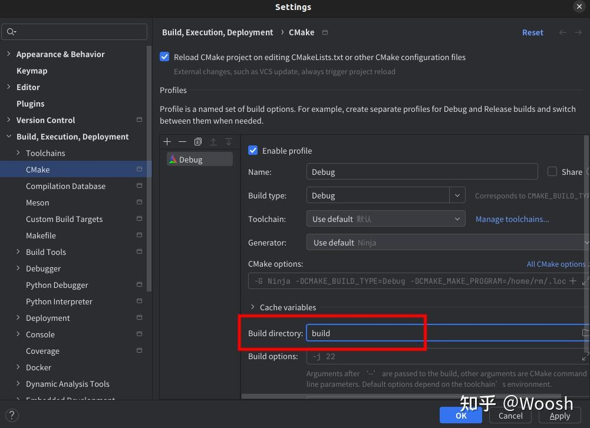

# Clion 中优雅的开发ROS2

工程的源码采用的是官方的的demo 
https://github.com/ros2/demos

操作方法采用的是知乎上的一个文章
https://zhuanlan.zhihu.com/p/693626476
下面的文字就是将知乎上的拷贝下来

clion打开的时候，在dev_ws这个目录(标准的ros2的colcon构建，是在这个目录下执行colcon build的，后面可以跟很多参数如功能包选择)

## 操作如下
    
### 前情提要

众所周知，ROS2是没有所谓workspace下toplevel的CMakeLists.txt的，所以也就没办法像ROS中那样直接管理整个工作空间。

一种方式是按照CLion的教程：https://www.jetbrains.com/help/clion/ros2-tutorial.html
这种方法麻烦的地方就是：这样依赖于compile_command.json，而调试或运行的时候需要自己创建custom build target...这显然太不优雅辣！

我们CLion用户从不低头

那到底如何使用CLion来开发一个workspace下的一个或者多个package呢？

### 基本配置

首先得安装好CLion和ROS 2，这里就假设大家的ROS 2是安装在/opt/ros下的，这里就以Ubuntu 22.04和ROS 2 Humble下的配置为例，一步步带大家配置一遍CLion
(我的环境是ubuntu20.04 ROS2 foxy，但是基本操作不差) 

安装ros可以参考鱼香ros的文章：https://fishros.org.cn/forum/topic/20/%E5%B0%8F%E9%B1%BC%E7%9A%84%E4%B8%80%E9%94%AE%E5%AE%89%E8%A3%85%E7%B3%BB%E5%88%97

wget http://fishros.com/install -O fishros && . fishros

### 工作空间管理

首先你应该有一个worksapce，我的习惯是在某个项目下创建两个工作空间，分别是dev_ws和build_ws。
之所以要分开成两个工作空间，是为了在使用colcon编译工作空间时不影响CLion的使用（大家在后面会看到详细的原因）。

mkdir -p demo/ demo/dev_ws demo/build_ws

为了方便复现，这里就以ROS 2的demos仓库作为我们的src目录下的软件包。

cd <your_path_to_demo>/dev_ws/

git clone https://github.com/ros2/demos src/

也许你需要checkout到你对应的ROS版本，以Humble为例：

cd src/

git checkout humble

现在demo目录下应该如下（适当省略了）：

    demo
    ├── build_ws
    └── dev_ws
        └── src
            ├── action_tutorials
            ├── ....
            ....

当然这里可以自己新建自己的工程，操作如下： 参考 https://fishros.com/d2lros2/#/

ros2新建功能包，进入dev_ws/src/目录下，执行

ros2 pkg create <package-name>  --build-type  {cmake,ament_cmake,ament_python}  --dependencies <依赖名字>

如：ros2 pkg create pkg01_helloworld_cpp --build-type ament_cmake --dependencies rclcpp --node-name helloworld

对于工程的理解，需要从ros2的构建系统讲起：

ros2的构建系统colcon(https://colcon.readthedocs.io/en/released/)是基于CMake的ament_cmake,
对于工程需要理解 他的CMakeLists.txt 有哪些特色 需要了解ament_cmake https://github.com/ament/ament_cmake/
由于官网的文档很少，可以参考ament_cmake_auto 参考 https://zhuanlan.zhihu.com/p/438191834 
而与ament_cmake同步使用的package.xml，由于是colcon自动生成的，所以不必特别放在心上

### CMakeLists.txt配置

之前提到了ROS 2没有提供toplevel的CMakeLists.txt，也就没有办法管理整个workspace.没有？我们就自己来实现一个。
如果大家看过ROS 中由catkin提供的toplevel.cmake文件的话，其实就会发现这差不多等效于将src/下的包通过add_subdirectory 引入全局项目中来。
既然如此，我们也可以类似的实现这样的一个toplevel.cmake.你可以直接参考这个：

https://github.com/kai-waang/colcon-toplevel-cmake

大家可以去这个github地址来看看(Toplevel CMakeLists.txt for developing ROS 2 with CLion and colcon)
github真的是开源圣地！！！

我们不想涉及太多细节了。来看怎么操作：

1、首先，克隆这个仓库：

git clone https://github.com/kai-waang/colcon-toplevel-cmake /opt/ros/scripts/cmake

2、接下来只要将该目录下的toplevel.cmake拷贝到刚刚的工作目录顶层即可（也就是和src/目录同级）。

cp /opt/ros/scripts/cmake/toplevel.cmake <your_path_to_demo>/dev_ws/CMakeLists.txt

注意: 如果不克隆到上述目录，那么就要相应地修改toplevel.cmake或dev_src/CMakeLists.txt 中相应的内容；
关于是否要克隆到顶层仓库，其实可以不这样做，但是这样会比较方便（我们后面会解释）

3、接下来用CLion打开dev_ws目录即可。你应该可以看到如下界面：

然后点击Add enviroment选择From File ,添加ROS 2的setup.sh文件即可：

如果你没有这个选项，说明你的CLion版本太老，可以更新至较新的版本。

4、点击OK后，CLion会重新加载CMake项目。现在还无法正常通过CMake的configure，这是因为在这个项目中有多个包还有多个名称相同的可执行文件目标：
    
    CMake Error at /opt/ros/humble/share/rclcpp_components/cmake/rclcpp_components_register_node.cmake:72 (add_executable):
    add_executable cannot create target "talker" because another target with
    the same name already exists.  The existing target is an executable created

这里就是我们使用add_subdirectory 无法避免的问题了：我们将工作空间中所有的构建项目加载到同一个编译命名空间下，就难以避免名称冲突。
所以这也是为什么ROS 2引入了colcon来统一构建项目，即它能很好的管理冲突问题。

当然，我们现在是想要我们的项目可以正常使用CLion加载，而不是感叹colcon的强大。所以有什么办法呢？

很简单，我们只要不同时引入这几个有冲突的包就好了（其实很少会有相同名称的可执行文件分布在同一个工作 空间下的不同的包内）。
这里大家可能已经注意到了toplevel.cmake中被我们注释的一行：
    
    colcon_add_subdirectories(
        BUILD_BASE "${PROJECT_SOURCE_DIR}/build"
        BASE_PATHS "${PROJECT_SOURCE_DIR}/src/"
        # --packages-select
    )
    
现在我们只要像使用colcon一样指定packages-select要选择的包即可，这里为了方便，我们就之加载一个包（demo_nodes_cpp）:
    
    colcon_add_subdirectories(
        BUILD_BASE "${PROJECT_SOURCE_DIR}/build"
        BASE_PATHS "${PROJECT_SOURCE_DIR}/src/"
        --packages-select demo_nodes_cpp
    )

5、现在重新加载CMake项目（Reload CMake Project），也许CLion会帮你自动重新加载（取决于你的配置），总之你应该可以看到：
    
    -- Configuring done (0.9s)
    -- Generating done (0.0s)
    -- Build files have been written to: ...

    [Finished]

6、到此已经完成了全部配置了。你可以发现各种build target已经全部出现（当然仅限于demo_nodes_cpp包内的）：

    
你可以选择性的引入一些其他的包，只要写在--packages-select后即可！
接下来就可以正常编译、运行和调试了！

### 其他配置
    
为了让CLion在开发ROS 2时候更加好用，我们还需要做一点点修改。当然这完全是我个人的一些习惯。
    
编译目录

修改Build directory，这是为了更符合ROS 2中的习惯：打开设置，选择Build, Execution, Deployment > CMake修改Build directory为build.

    
关闭CMake Dev警告,
在我使用中，会经常有类似警告：

    Call Stack (most recent call first):
    /opt/ros/humble/share/launch_testing_ament_cmake/cmake/launch_testing_ament_cmake-extras.cmake:18 (find_package)
    /opt/ros/humble/share/launch_testing_ament_cmake/cmake/launch_testing_ament_cmakeConfig.cmake:41 (include)
    /opt/ros/humble/share/ament_lint_auto/cmake/ament_lint_auto_find_test_dependencies.cmake:36 (find_package)
    src/demo_nodes_cpp/CMakeLists.txt:150 (ament_lint_auto_find_test_dependencies)
    This warning is for project developers.  Use -Wno-dev to suppress it.

我们就直接关闭这个警告：

这样CLion在加载CMake 项目时就不会有类似的警告了。

编译含有自定义Interfaces的包
当你需要使用自定义的消息类型，例如msg srv等等，往往会碰到报错。这部分有空补充。
回调函数中clang-tidy的警告

相信大家也见过类似的警告。其实是由于ConstSharedPtr这种类型的智能指针在拷贝时也会有开销，应该使用引用来避免拷贝。这里我们也可以直接关闭这个警告，只需要让检查器忽略以[Ptr|ptr|Ref|ref]结尾的类型即可：
在下方工具栏点击.clang-tidy选择Configure Inspection Settings

然后点击Configure Clang-Tidy Checks Options...

找到选项：performance-unnecessary-value-param.AllowedTypes 修改为：

    [Pp]ointer$|[Pp]tr$|[Rr]ef(erence)?$

即可。如下：

这里是用了clang-tidy基于正则的匹配规则，不多介绍了。
这样一来，检查器的警告应该消失了。
