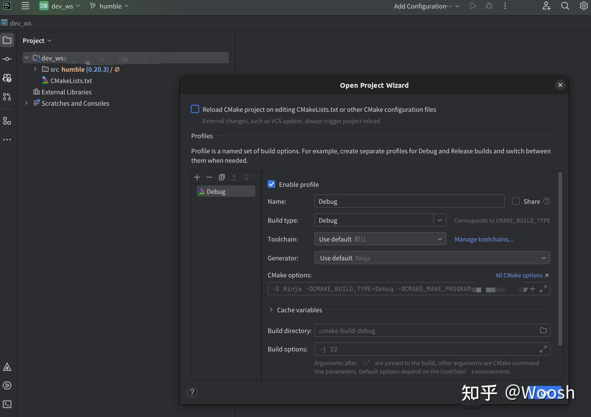

# Clion 中优雅的开发ROS2

## 工程的来源及计划

工程的源码采用的是官方的的demo 
https://github.com/ros2/demos

操作方法采用的是知乎上的一个文章
https://zhuanlan.zhihu.com/p/693626476
下面的文字就是将知乎上的拷贝下来

工程内代码编写参考B站鱼香ROS的《ROS2机器人开发从入门到实践》
https://www.bilibili.com/video/BV1GW42197Ck/?spm_id_from=333.1007.top_right_bar_window_custom_collection.content.click

接下来项目分为三部分来说
1、ros2环境安装以及标准情况下新建工程、构建工程的说明
2、在Clion环境下新建工程、构建工程说明；及与标准情况的不同(其实特别的小)
3、跟着小鱼学ROS2(视频中用的例程多是python的，而本文是基于c++的，所以代码的功能是基于b站视频的，但是代码编写参考是基于小鱼ros的网站的)

应该清楚ROS2的cpp是处于自己cpp编程的哪个位置，从ROS2是为机器人服务定位，基于节点Node的通信机制
有话题(topic 发布订阅)、服务(service C/S)、参数(param)、动作(action )的通信机制，
重点是对节点(node)的通信,整合到自己的cpp编程模块，再整合到自己的整个编程系统中。

主函数的一般模式

    int main(int argc,char **argv){
        rclcpp::init(argc,argv);
        auto node = make_shared<>();
        rclcpp::spin(node);
        rclcpp::shutdown();
        return 0;
    }

**下面的通信机制中 XXX表示通信接口 可以通过 ros2 interface list | grep XXX 查看接口是否存在，如果不存在可能需要在接口生成的工作空间内，source install/local_setup.bash**

话题 topic

    发布
    rclcpp::Publisher<XXX>::SharedPtr pub_
    rclcpp::Node::create_publisher()
    rclcpp::Publisher::publish()
        定时器
    rclcpp::TimerBase::SharedPtr timer_
    rclcpp::create_wall_timer() //(内有回调 void (void))，不是必须的，有定时的，也有从设备读取到后，直接发布的
    
    订阅
    rclcpp::Subscription<XXX>::SharedPtr sub_
    rclcpp::Node::create_subscription<XXX>()//(内有回调 void (XXX::::SharedPtr msg))
    
    命令行 ros2 topic pub/echo

服务 service

    服务端
    rclcpp::Service<XXX>::SharedPtr server_
    rclcpp::Node::create_service<XXX>()//内有回调 void handle(const std::shared_ptr<XXX::Request> request,std::shared_ptr<XXX::Response> response)
    
    客户端
    rclcpp::Client<XXX>::SharedPtr client_
    rclcpp::Node::create_client<XXX>()
    void send_request(XXX::SharedPtr request)
    void response_cb(rclcpp::Client<XXX>::SharedFuture result)
    客户端调用send_request 函数发送请求
    send_request 函数的一般处理过程 假设 客户端类为MyClient 类内的ros2 客户端handle为 _client
        //1.等待服务上线
        while (!_client->wait_for_service(std::chrono::seconds(1))) {
            //等待时检测rclcpp的状态
            if (!rclcpp::ok()) {
                RCLCPP_ERROR(this->get_logger(), "等待服务的过程中被打断...");
                return;
            }
            RCLCPP_INFO(this->get_logger(), "等待服务端上线中");
        }
        // 2.发送异步请求，然后等待返回，返回时调用回调函数
        _client->async_send_request(
                request, std::bind(&MyClient::response_cb, this,
                                   std::placeholders::_1));

    命令行 ros2 service call

参数 param

    rclcpp::Node::declare_parameter
    rclcpp::Node::get_parameter
        定时器
    rclcpp::Node::create_wall_timer //通过定时器来达到能一直更新参数的目的
    这里参数一般都是通过命令行来设置的
    
    命令行 ros2 param get/set

动作 action

    服务端 假设服务端类名为 ActionRobot
    rclcpp_action::Server<XXX>::SharedPtr action_server_
    rclcpp_action::create_server<XXX>(this,"action_server",
                                    std::bind(&ActionRobot::handle_goal,this,std::placeholders::_1,std::placeholders::_2),
                                                          std::bind(&ActionRobot::handle_cancel,this,std::placeholders::_1),
                                                          std::bind(&ActionRobot::handle_accepted,this,std::placeholders::_1))

    rclcpp_action::GoalResponse handle_goal(const rclcpp_action::GoalUUID &uuid, shared_ptr<const XXX::Goal> goal) //收到目标，反馈是否可以执行该目标，可以则返回ACCEPT_AND_EXECUTE,不可以则返回REJECT
    rclcpp_action::CancelResponse handle_cancel(const std::shared_ptr<rclcpp_action::ServerGoalHandle<XXX>> goal_handle) //收到取消运行请求，可以则返回ACCEPT，不可以返回REJECT
    void execute_move(const std::shared_ptr<rclcpp_action::ServerGoalHandle<XXX>> goal_handle) //处理接受请求，当handle_goal中对移动请求ACCEPT后则进入到这里进行执行，这里我们是单独开了个线程进行执行execute_move函数，目的是避免阻塞主线程

    void handle_accepted(const std::shared_ptr<rclcpp_action::ServerGoalHandle<XXX>> goal_handle) {
        using std::placeholders::_1;
        std::thread{std::bind(&ActionRobot::execute_move, this, _1), goal_handle}
                .detach();
    }
    execute_move 是主要执行函数
    主要关注信息为 XXX::Goal XXX::Result XXX::Feedback 即.action文件中的第1 2 3段内容

    客户端
    rclcpp_action::Client<XXX>::SharedPtr client_ptr_
    rclcpp_action::create_client<XXX>(this, "move_robot")

    void goal_response_callback(shared_future<rclcpp_action::ClientGoalHandle<XXX>::SharedPtr> future)
    void feedback_callback(
            rclcpp_action::ClientGoalHandle<XXX>::SharedPtr,
            const std::shared_ptr<const XXX::Feedback> feedback)
    void result_callback(const rclcpp_action::ClientGoalHandle<XXX>::WrappedResult &result)

    上面的三个函数是为了组成发送目标的
        auto send_goal_options =
                rclcpp_action::Client<MoveRobot>::SendGoalOptions();
        send_goal_options.goal_response_callback =
                std::bind(&ActionControl::goal_response_callback, this, placeholders::_1);
        send_goal_options.feedback_callback =
                std::bind(&ActionControl::feedback_callback, this, placeholders::_1, placeholders::_2);
        send_goal_options.result_callback =
                std::bind(&ActionControl::result_callback, this, placeholders::_1);
        this->client_ptr_->async_send_goal(goal_msg, send_goal_options);

    上面的会在  void send_goal() 调用

    实验中用定时器，来作发送目标的任务
    
    命令行 ros2 action send_goal 

通信机制对比总结

话题、服务、动作都是有可能需要自定义接口的

1.话题
话题（Topic）是一种轻量级的通信方式，用于实现发布-订阅模式，即一个节点发布数据，另一个节点订阅数据。
话题是一种单向的通信方式，发布者发布数据后，无法获知数据是否被订阅者成功接收。
话题的数据类型可以是ROS中定义的任意消息类型。常见的使用话题实现的场景包括传感器数据的传递、节点间的状态信息交换等。

2.服务
服务是双向的，提供了一种客户端-服务器模式，即客户端向服务器发送请求，服务器响应请求并返回结果。
服务可以实现双向通信，并且支持传递任意的ROS消息类型。
服务的实现需要定义两个消息类型，一个用于请求，一个用于响应。常见的使用服务实现的场景包括节点之间的命令调用、请求数据等。

3.参数
参数（Parameter）是ROS 2中节点的一种配置机制，它可以用于对节点进行设置。
参数可以存储整数、浮点数、布尔值、字符串等基本类型数据，也可以存储ROS消息类型。
参数的读写操作可以通过服务实现。
在节点启动时，可以通过ROS参数服务器将参数传递给节点，
也可以在运行时动态修改参数。常见的使用参数的场景包括节点的配置、调试等。原理基于服务。

4.动作
动作（Action）是ROS 2中的高级通信机制，它可以实现异步的双向通信，并且支持取消、暂停、恢复等操作。
动作通常用于需要执行较长时间的任务，如机器人的导航、物体识别等。
与服务不同，动作可以通过话题实时发布执行状态、进度等信息，以便客户端监控执行情况。
动作的实现需要定义三个消息类型，一个用于请求，一个用于响应，一个用于反馈。
常见的使用动作的场景包括机器人的自主导航、物体抓取等。

不同节点之间消息同步的接口
message_filters::TimeSynchronizer

## ros2环境安装以及标准情况下新建工程、构建工程的说明

ROS2 安装及对ament_cmake的理解

### 安装ROS2
首先得安装好CLion和ROS 2，这里就假设大家的ROS 2是安装在/opt/ros下的，这里就以Ubuntu 22.04和ROS 2 Humble下的配置为例，一步步带大家配置一遍CLion
(我的环境是ubuntu20.04 ROS2 foxy，但是基本操作不差)

安装ros可以参考鱼香ros的文章：https://fishros.org.cn/forum/topic/20/%E5%B0%8F%E9%B1%BC%E7%9A%84%E4%B8%80%E9%94%AE%E5%AE%89%E8%A3%85%E7%B3%BB%E5%88%97

wget http://fishros.com/install -O fishros && . fishros

安装完毕后，因为在 /etc/bashrc.bash中添加了ros2的环境变量 造成ros2的守护进程会一直存在(会很卡的，可以手动取消下)
/usr/bin/python3 /opt/ros/foxy/bin/_ros2_daemon

### 新建工程

新建工作空间 xx_ws（可随意命名）,就是新建目录 xx_ws，新建src(不可随意命名)目录

ros2新建功能包，进入xx_ws/src/目录下，执行

ros2 pkg create <package-name>  --build-type  {cmake,ament_cmake,ament_python}  --dependencies <依赖名字>

如：ros2 pkg create helloworld_cpp --build-type ament_cmake --dependencies rclcpp --node-name helloworld

修改代码 (代码的参考内容可以参考ros2的官方示例 https://github.com/ros2/demos)

### 构建工程
ros2的构建系统colcon(https://colcon.readthedocs.io/en/released/)是基于CMake的ament_cmake,
对于工程需要理解 他的CMakeLists.txt 有哪些特色 需要了解ament_cmake https://github.com/ament/ament_cmake/
由于官网的文档很少，可以参考ament_cmake_auto 参考 https://zhuanlan.zhihu.com/p/438191834
而与ament_cmake同步使用的package.xml，由于是colcon自动生成的，所以不必特别放在心上
** 对于上述改变完全没必要出现既然有cmake了，为什么还要再加一层ament_cmake。要从ROS2方便用户玩转ROS2的角度看，
以VUE的工程新建方式来看待过程，就是执行ros2 pkg create 后，是用模板的方式，快速构建一个基于ament_cmake或者cmake的ros2工程范例。

新建工作空间 ROS2_demo,就是新建目录 ROS2_demo，新建src目录

ros2新建功能包，进入ROS2_demo/src/目录下，执行

ros2 pkg create <package-name>  --build-type  {cmake,ament_cmake,ament_python}  --dependencies <依赖名字>

如：ros2 pkg create helloworld_cpp --build-type ament_cmake --dependencies rclcpp --node-name helloworld

构建
在进入ROS2_demo目录下
执行 colcon build --packages-select helloworld_cpp

这样会在ROS2_demo目录下新出来 build install log 三个目录

要运行自己的包
在 ROS2_demo目录下
source install/setup.bash
然后就可以执行
ros2 run helloworld_cpp helloworld

** 注意 ros2 run 后可以tab 自动补全看看自己的包是否在环境变量中， 同样可以用 printenv | grep AME 来查看，自己的路径是否添加进 AMENT_PREFIX_PATH 中，

** 下面经过改造后的工程结构和一般ros2的唯一的不同就是在执行 colcon build 时，无法选择包，但编译不报错，
同样在source install/setup.bash 后 无法将自己工程的路径添加到 AMENT_PREFIX_PATH，从而导致无法通过ros2 run 来运行包，但是不影响执行运行可以执行程序。

** 上面的情况可以通过把ROS2_demo目录下的CMakeLists.txt改名的方式，来断开自己修改的影响。
这种情况适用于，在改造情况下通过clion完全的实验好代码后，再别名下CMakeLists.txt，通过标准的ros2构建 colcon build

## 在Clion环境下新建工程、构建工程说明；及与标准情况的不同(其实特别的小)

Clion上开发ROS2的操作 
**对于自定义接口的构建还是ROS2原生的套路，使用colcon build 来构建**
    
### 前情提要

众所周知，ROS2是没有所谓workspace下toplevel的CMakeLists.txt的，所以也就没办法像ROS中那样直接管理整个工作空间。

一种方式是按照CLion的教程：https://www.jetbrains.com/help/clion/ros2-tutorial.html
这种方法麻烦的地方就是：这样依赖于compile_command.json，而调试或运行的时候需要自己创建custom build target...这显然太不优雅辣！

我们CLion用户从不低头

那到底如何使用CLion来开发一个workspace下的一个或者多个package呢？

### 工作空间管理

参考 https://fishros.com/d2lros2/#/

首先你应该有一个worksapce，我的习惯是在某个项目下创建工作空间，ROS2_demo。
之所以要分开成两个工作空间，是为了在使用colcon编译工作空间时不影响CLion的使用（大家在后面会看到详细的原因）。

mkdir ROS2_demo 

cd ROS2_demo

mkdir src

现在demo目录下应该如下（适当省略了）：

    ROS2_demo
        └── src
    
ros2新建功能包，进入ROS2_demo/src/目录下，执行

ros2 pkg create <package-name>  --build-type  {cmake,ament_cmake,ament_python}  --dependencies <依赖名字>

如：ros2 pkg create helloworld_cpp --build-type ament_cmake --dependencies rclcpp --node-name helloworld

这时目录的样子：

    ROS2_demo
        └── src
            ├── helloworld_cpp
            ├── ....
            ....

### CMakeLists.txt配置

之前提到了ROS 2没有提供toplevel的CMakeLists.txt，也就没有办法管理整个workspace.没有？我们就自己来实现一个。
如果大家看过ROS 中由catkin提供的toplevel.cmake文件的话，其实就会发现这差不多等效于将src/下的包通过add_subdirectory 引入全局项目中来。
既然如此，我们也可以类似的实现这样的一个toplevel.cmake.你可以直接参考这个：

https://github.com/kai-waang/colcon-toplevel-cmake

大家可以去这个github地址来看看(Toplevel CMakeLists.txt for developing ROS 2 with CLion and colcon)
github真的是开源圣地！！！

我们不想涉及太多细节了。来看怎么操作：

1、新建 ros2 包
ros2 pkg create helloworld_cpp --build-type ament_cmake --dependencies rclcpp --node-name helloworld

git clone https://github.com/kai-waang/colcon-toplevel-cmake /opt/ros/scripts/cmake

2、接下来只要将该目录下的toplevel.cmake拷贝到刚刚的工作目录顶层即可（也就是和src/目录同级）。

cp /opt/ros/scripts/cmake/toplevel.cmake <your_path_to_demo>/ROS2_demo/CMakeLists.txt

注意: 如果不克隆到上述目录，那么就要相应地修改toplevel.cmake或dev_src/CMakeLists.txt 中相应的内容；
关于是否要克隆到顶层仓库，其实可以不这样做，但是这样会比较方便（我们后面会解释）

3、接下来用CLion打开ROS2_demo目录即可。你应该可以看到如下界面：

然后点击Add enviroment选择From File ,添加ROS 2的setup.sh文件即可：

如果你没有这个选项，说明你的CLion版本太老，可以更新至较新的版本。

4、点击OK后，CLion会重新加载CMake项目。现在还无法正常通过CMake的configure，这是因为在这个项目中有多个包还有多个名称相同的可执行文件目标：
    
    CMake Error at /opt/ros/humble/share/rclcpp_components/cmake/rclcpp_components_register_node.cmake:72 (add_executable):
    add_executable cannot create target "talker" because another target with
    the same name already exists.  The existing target is an executable created

这里就是我们使用add_subdirectory 无法避免的问题了：我们将工作空间中所有的构建项目加载到同一个编译命名空间下，就难以避免名称冲突。
所以这也是为什么ROS 2引入了colcon来统一构建项目，即它能很好的管理冲突问题。

当然，我们现在是想要我们的项目可以正常使用CLion加载，而不是感叹colcon的强大。所以有什么办法呢？

很简单，我们只要不同时引入这几个有冲突的包就好了（其实很少会有相同名称的可执行文件分布在同一个工作 空间下的不同的包内）。
这里大家可能已经注意到了toplevel.cmake中被我们注释的一行：
    
    colcon_add_subdirectories(
        BUILD_BASE "${PROJECT_SOURCE_DIR}/build"
        BASE_PATHS "${PROJECT_SOURCE_DIR}/src/"
        # --packages-select
    )
    
现在我们只要像使用colcon一样指定packages-select要选择的包即可，这里为了方便，我们就之加载一个包（demo_nodes_cpp）:
    
    colcon_add_subdirectories(
        BUILD_BASE "${PROJECT_SOURCE_DIR}/build"
        BASE_PATHS "${PROJECT_SOURCE_DIR}/src/"
        --packages-select demo_nodes_cpp
    )

5、现在重新加载CMake项目（Reload CMake Project），也许CLion会帮你自动重新加载（取决于你的配置），总之你应该可以看到：
    
    -- Configuring done (0.9s)
    -- Generating done (0.0s)
    -- Build files have been written to: ...

    [Finished]

6、到此已经完成了全部配置了。你可以发现各种build target已经全部出现（当然仅限于demo_nodes_cpp包内的）：

    
你可以选择性的引入一些其他的包，只要写在--packages-select后即可！
接下来就可以正常编译、运行和调试了！

### 其他配置
    
为了让CLion在开发ROS 2时候更加好用，我们还需要做一点点修改。当然这完全是我个人的一些习惯。
    
编译目录

修改Build directory，这是为了更符合ROS 2中的习惯：打开设置，选择Build, Execution, Deployment > CMake修改Build directory为build.

    
关闭CMake Dev警告,
在我使用中，会经常有类似警告：

    Call Stack (most recent call first):
    /opt/ros/humble/share/launch_testing_ament_cmake/cmake/launch_testing_ament_cmake-extras.cmake:18 (find_package)
    /opt/ros/humble/share/launch_testing_ament_cmake/cmake/launch_testing_ament_cmakeConfig.cmake:41 (include)
    /opt/ros/humble/share/ament_lint_auto/cmake/ament_lint_auto_find_test_dependencies.cmake:36 (find_package)
    src/demo_nodes_cpp/CMakeLists.txt:150 (ament_lint_auto_find_test_dependencies)
    This warning is for project developers.  Use -Wno-dev to suppress it.

我们就直接关闭这个警告：

这样CLion在加载CMake 项目时就不会有类似的警告了。

编译含有自定义Interfaces的包
当你需要使用自定义的消息类型，例如msg srv等等，往往会碰到报错。这部分有空补充。
回调函数中clang-tidy的警告

相信大家也见过类似的警告。其实是由于ConstSharedPtr这种类型的智能指针在拷贝时也会有开销，应该使用引用来避免拷贝。这里我们也可以直接关闭这个警告，只需要让检查器忽略以[Ptr|ptr|Ref|ref]结尾的类型即可：
在下方工具栏点击.clang-tidy选择Configure Inspection Settings

然后点击Configure Clang-Tidy Checks Options...

找到选项：performance-unnecessary-value-param.AllowedTypes 修改为：

    [Pp]ointer$|[Pp]tr$|[Rr]ef(erence)?$

即可。如下：

这里是用了clang-tidy基于正则的匹配规则，不多介绍了。
这样一来，检查器的警告应该消失了。

### 自定义接口文件

可以直接将 build目录下的 工程名文件夹 下的 rosidl_generator_cpp 下的 文件夹 拷贝到 工程目录下的 include文件夹下

## 跟着小鱼学ROS2

工程目录

build 构建结果目录
interfaces  自定义接口目录，要使用自定义接口，构建时 在ROS2_demo/interfaces目录下执行 colcon build，必须在ROS_demo目录下，执行 source interfaces/install/setup.bash
src 真正的工程目录，可以构建多个ROS2 的Node

### 1、四种基本通信机制

#### 话题

有4个关键点
1、发布者
2、订阅者
3、话题名称
4、话题类型

查看节点列表

    ros2 node list
查看指定节点信息
    
    ros2 node info xxxx（节点名称）
    里面会有 内容都是以话题名称+话题类型 组织的
    Subscribers 订阅者
    Publishers  订阅者
    Service Servers 
    Service Clients
    Action Servers
    Action Clients

查看话题情况

    ros2 topic info xxxx

查看本地默认的消息类型

    ros2 interface list

查看话题的消息类型

    ros2 interface show xxxx

##### 通过话题发布小说

代码中采用的是最简单的发布订阅代码，同时内容还是简单。
    
##### 让小海龟画圆

1、首先启动小海龟节点

    ros2 run  turtlesim turtlesim_node

2、查看话题列表

    ros2 topic list -t

    /parameter_events [rcl_interfaces/msg/ParameterEvent]
    /rosout [rcl_interfaces/msg/Log]
    /turtle1/cmd_vel [geometry_msgs/msg/Twist]
    /turtle1/color_sensor [turtlesim/msg/Color]
    /turtle1/pose [turtlesim/msg/Pose]

3、主要通过向 /turtle1/cmd_vel 话题发布运行信息 cpp代码实现发布者 turtle_circle.cpp

##### 告诉小海龟到指定位置，自己过去

启动小海龟节点后
通过订阅 /turtle1/pose 话题的位置信息，实时计算距离差和角度差，然后通过闭环控制来计算小海龟需要的线速度和角速度。
然后通过发布 /turtle1/cmd_vel 话题的运行信息，实现海龟闭环运动到指定位置。

##### 通过这个小工具查看系统的实时状态信息，还得让局域网内的其他主机也能查看这些数据

自定义接口 (很重要)

    在interfaces/目录下
    ros2 pkg create system_status_interface --dependencies rosidl_default_generators builtin_interfaces 
    然后删除 src/system_status_interface/目录下的 include src ，新建 msg 目录，新建SystemStatus.msg 
    (必须是首字母大写的驼峰 规则详见 https://docs.ros.org/en/foxy/Tutorials/Beginner-Client-Libraries/Custom-ROS2-Interfaces.html#)，
    输入以下内容
    builtin_interfaces/Time stamp #记录时间戳
    string host #主机名字
    float32 cpu_percent #CPU使用率
    float32 memory_percent #内存使用率
    float32 memory_total #内存总大小
    float32 memory_available #内存剩余
    float64 net_sent #网络发送总量 MB
    float64 net_recv #网络接收总量 MB

    在interfaces/system_status_interface目录下修改CMakeLists.txt,在 所有的find_package()后，添加生成接口文件的命令
    
    rosidl_generate_interfaces(${PROJECT_NAME}
        "msg/SystemStatus.msg"
        DEPENDENCIES builtin_interfaces
    )

    在interfaces/system_status_interface目录下修改package.xml,将 <member_of_group>rosidl_interface_packages</member_of_group> 添加到 package.xml中
    
    在 interfaces/ 目录下 执行 colcon build 把接口新建出来

**下面的步骤就是在clion的情况下引入使用接口**

恢复要构建的工程
在ROS2_demo目录下, 在终端输入 source interfaces/install/setup.bash 在该终端打开clion

在ROS2_demo/src/fishros_cpp/目录下的CMakeLists.txt中添加接口的依赖
    
添加依赖

    find_package(system_status_interface REQUIRED)
    ament_target_dependencies(
        system_status_pub
        "rclcpp"
        "system_status_interface"
    )

这里就引出了其实clion也就是代码编辑器的作用，很多时候它编译出来的程序需要在特定的系统环境下才能运行。(clion的终端能正确运行ros2的命令，也是因为系统的/etc/bashrc.bash中添加了ros2的local_setup.sh)
colcon build的原则： 为了不污染ros2原始的环境，所以自定义接口就没有install到ros2的环境中，而是以intall目录下工作空间(xxx_ws)的local_setup.bash include/ lib/ share/ 的形式呈现出来。
和ros2安装后的环境样子很像。

所以基于以上原因，我会在系统上新建一个开启clion的脚本，用于配合这种情况。这样的话，clion开启后，可以关闭该终端了。开启clion的脚本如下

    ~/IDE/CLion-2023.3.5/clion-2023.3.5/bin/clion.sh &

**自定义接口能够在系统中运行的主要原因是 ros2 列表接口的时候它能存在即 ros2 interface list | grep xxx_interface(自定义接口名称)**

##### rqt 工具

    rqt 是一个用qt写的ros2的可视化工具，很多的命令就可以不用手输入了。很方便

#### 服务

##### 创建一个人脸检测服务，提供图像，返回人脸数量位置信息

    这里会用到ros2 的 sensor_msgs::Image 到OpenCV 的 cv::Mat 的数据转换库 cv_bridge。操作的参考为 https://blog.csdn.net/bigdog_1027/article/details/79090571    

新建服务接口
    
    在interfaces/目录下
    ros2 pkg create face_recognition --dependencies rosidl_default_generators sensor_msgs
    然后删除 src/face_recognition/目录下的 include src ，新建 srv目录，新建FaceDetector.srv，输入以下内容
    sensor_msgs/Image image # 人脸图像
    ---
    int16 number #人脸数量
    float32 use_time #识别耗时
    int32[] top #人脸位置 top
    int32[] right #人脸位置 right
    int32[] bottom #人脸位置 bottom
    int32[] left #人脸位置 left

    在interfaces/face_recognition目录下修改CMakeLists.txt,在 所有的find_package()后，添加生成接口文件的命令
    
    rosidl_generate_interfaces(${PROJECT_NAME}
        "srv/FaceDetector.srv"
        DEPENDENCIES sensor_msgs
    )

    在interfaces/face_recognition目录下修改package.xml,将 <member_of_group>rosidl_interface_packages</member_of_group> 添加到 package.xml中

    在 interfaces/ 目录下 执行 colcon build 把接口新建出来

打开终端 在ROS2_demo 目录下 输入 source interfaces/install/setup.bash 后 启动clion
在fishros_cpp的src/目录下，人脸识别的服务 face_recognition_server 人脸服务的客户端 face_recognition_client

#### 参数

参数被视为节点的设置，是基于**服务通信**实现的 代码是基于 https://fishros.com/d2lros2/#/humble/chapt4/get_started/2.%E5%8F%82%E6%95%B0%E4%B9%8BRCLCPP%E5%AE%9E%E7%8E%B0

#### 动作

动作，是由话题和服务共同构建出来的（一个Action = 三个服务+两个话题） 
三个服务分别是：1.目标传递服务 2.结果传递服务 3.取消执行服务 
两个话题：1.反馈话题（服务发布，客户端订阅） 2.状态话题（服务端发布，客户端订阅）
Action的三大组成部分目标、反馈和结果

代码是基于 https://fishros.com/d2lros2/#/humble/chapt4/get_started/4.%E5%8A%A8%E4%BD%9C%EF%BC%88Action%EF%BC%89%E9%80%9A%E4%BF%A1%E4%B8%8E%E8%87%AA%E5%AE%9A%E4%B9%89%E6%8E%A5%E5%8F%A3

#### 通信机制小结

学习完4中通信机制后，可以在ros2的环境下进行节点间的对话，以及使用launch来启动一组节点。这个就是基础的框架完成了，就可以利用基础来进行进阶练习，比如数据的处理。

### 2、ROS2的工具 rqt---rviz2---ros2 bag

#### 坐标变换工具TF

    基础的命令行操作
    ros2 run tf2_ros static_transform_publisher --help
    A command line utility for manually sending a transform.
    Usage: static_transform_publisher x y z qx qy qz qw frame_id child_frame_id
    OR
    Usage: static_transform_publisher x y z yaw pitch roll frame_id child_frame_id

    假设 小车的位置 base_link(0.0，0.0，0.0) 小车上的雷达 base_laser(0.1,0.0,0.2)  墙的点 wall_point(0.3,0.0,0.0)
    看墙到小车的位置关系
    ros2 run tf2_ros static_transform_publisher 0.1 0.0 0.2 0.0 0.0 0.0 base_link base_laser
    ros2 run tf2_ros static_transform_publisher 0.3 0.0 0.0 0.0 0.0 0.0 base_laser wall_point
    ros2 run tf2_ros tf2_echo base_link wall_point    
    ros2 run tf2_tools view_frames 可以保存转换的关系为pdf文件
    foxy和humble的版本输入和输出样子有所不同，但是结果是一样
    
    使用可视化工具
    sudo apt install ros-foxy-mrpt2
    启动 3d-rotation-converter

编程用到的tf2

    sudo apt install ros-foxy-tf-transformations
    pip3 install transforms3d

#### 一个坐标关系的转换
    
假设地图坐标系为map，机器人坐标系为base_link 目标点为target_point，(这里的map可以理解为坐标原点)
已知map到base_link之间的关系、map到target_point的关系，
要控制机器人到达目标点，计算目标点和机器人之间的关系
target_point (5.0,3.0,0.0   0,0,60)
base_link (2.0,3.0,0.0   0, 0,30)
demo_tf_static_broadcaster.cpp 描述目标的
    
    _broadcaster = std::make_shared<tf2_ros::StaticTransformBroadcaster>(this);
    geometry_msgs::msg::TransformStamped transform;
    transform.header.stamp = get_clock()->now();
    transform.header.frame_id = "map";
    transform.child_frame_id = "target_point";//(5.0,3.0,0.0    0,0,60)
    transform.transform.translation.x = 5.0;
    transform.transform.translation.y = 3.0;
    transform.transform.translation.z = 0.0;
    tf2::Quaternion q;
    q.setRPY(0, 0, 60 * M_PI / 180);
    transform.transform.rotation = tf2::toMsg(q);
    this->_broadcaster->sendTransform(transform);

demo_tf_dynamic_broadcaster.cpp 描述机器人的，
    
    _broadcaster = std::make_shared<tf2_ros::TransformBroadcaster>(this);
    _timer = this->create_wall_timer(100ms,std::bind(&DynamicTFBroadcaster::publish_tf,this));

    //发布函数
    void publish_tf() {
        geometry_msgs::msg::TransformStamped transform;
        transform.header.stamp = get_clock()->now();
        transform.header.frame_id = "map";
        transform.child_frame_id = "base_link";//(2.0,3.0,0.0    0,0,30)
        transform.transform.translation.x = 2.0;
        transform.transform.translation.y = 3.0;
        transform.transform.translation.z = 0.0;
        tf2::Quaternion q;
        q.setRPY(0, 0, 30 * M_PI / 180);
        transform.transform.rotation = tf2::toMsg(q);
        this->_broadcaster->sendTransform(transform);
    }

编程完毕后，可以通过rviz软件来查看
计算坐标关系，原理是通过订阅 /tf /tf_static 收集所有坐标系关系，进行计算

### 3、机器人建模和仿真

移动机器人结构
                    -->执行器-->
            控制系统                环境+机器人
                    <--传感器<--

gazebo(https://gazebosim.org/home)是一个开源的3D机器人仿真器 使用的文件格式是sdf的，是继承和扩展了urdf的
URDF(Unified Robot Description Format https://wiki.ros.org/cn/urdf 可以在维基百科上查看相应的文档) 统一机器人描述格式
Xacro(XML Macros ，Xacro 是 XML 宏定义语言，方便模块化 http://www.ros.org/wiki/xacro 可以在维基百科上查看相应的文档)  可以简化URDF sudo apt install ros-foxy-xacro

ros2_control 使用ros2进行机器人控制的框架。

使用gazebo接入ros2_control,其实就是让gazebo按照ros2_control指定的接口提供数据。在ros2中利用相应的gazebo插件，
可以方便的实现gazebo和ros2_control的对接 ros-foxy-gazebo-ros2-control

能够熟练的使用
rqt---查看节点的订阅发布情况
rviz2---查看模型的情况
gazebo---加载模型，并能通过gazebo-ros-control来进行操作的仿真

### 4、机器人导航

使用slam_toolbox 构建导航地图。sudo apt install ros-foxy-slam-toolbox

    可以在gazebo启动模拟后，
    通过启动 slam_tool(ros2 launch slam_toolbox online_async_launch.py use_sim_time:=True)监听模拟器发出的标准信息结果，然后在rviz中通过将基坐标设置为odom,查看laserScan的建图情况
使用nav2-map-server来将地图保存为文件。sudo apt install ros-foxy-nav2-map-server
    ros2 run nav2_map_server map_saver_cli -f room

navigation2(https://github.com/ros-navigation/navigation2)是一个开源的机器人导航框架。
sudo apt install ros-foxy-navigation2
sudo apt install ros-foxy-nav2-bringup

**实验的时候，和小鱼视频的不一样，可以先打开nav2的launch，在打开gazebo的launch**

可以查看 acml节点的信息 ros2 info /acml
可以通过命令行进行机器人位置的初始化
ros2 topic pub /initialpose geometry_msgs/msg/PoseWithCovarianceStamped "{header: {frame_id: map}}" --once

#### 小结

nav2 slam-toolbox gazebo 都是基于ros2的优秀的仿真软件，什么叫基于，就是基于roa2的通信机制。
熟练的使用ros2的命令行和rqt查看ros2工作节点间的通信内容、rviz查看tf间的坐标关系、以及工具提供的标准的话题和服务的接口
是完整运行建图与导航的关键。